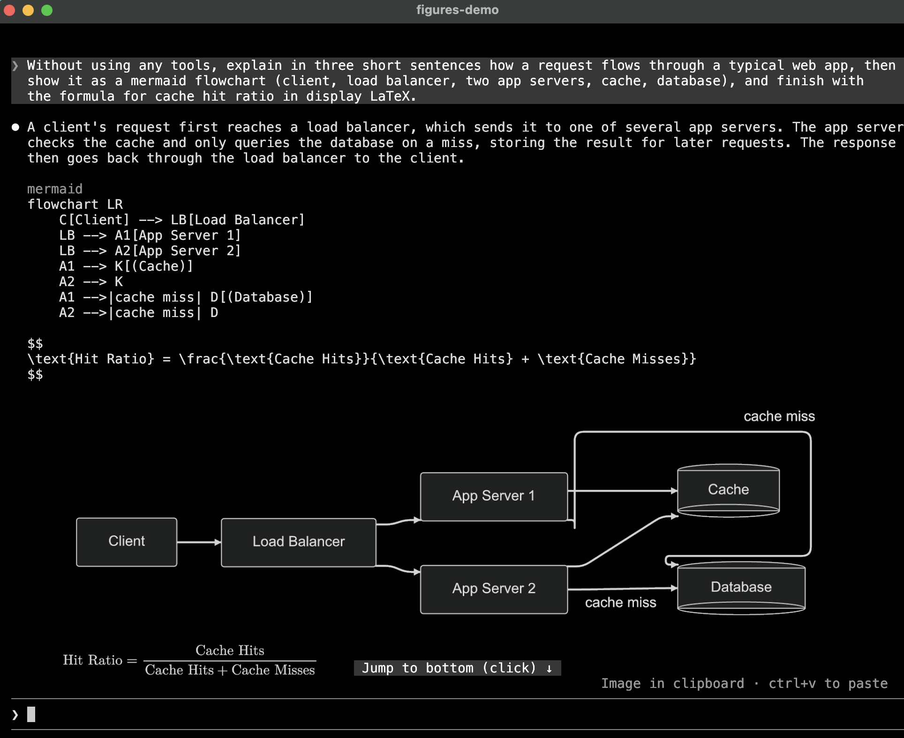
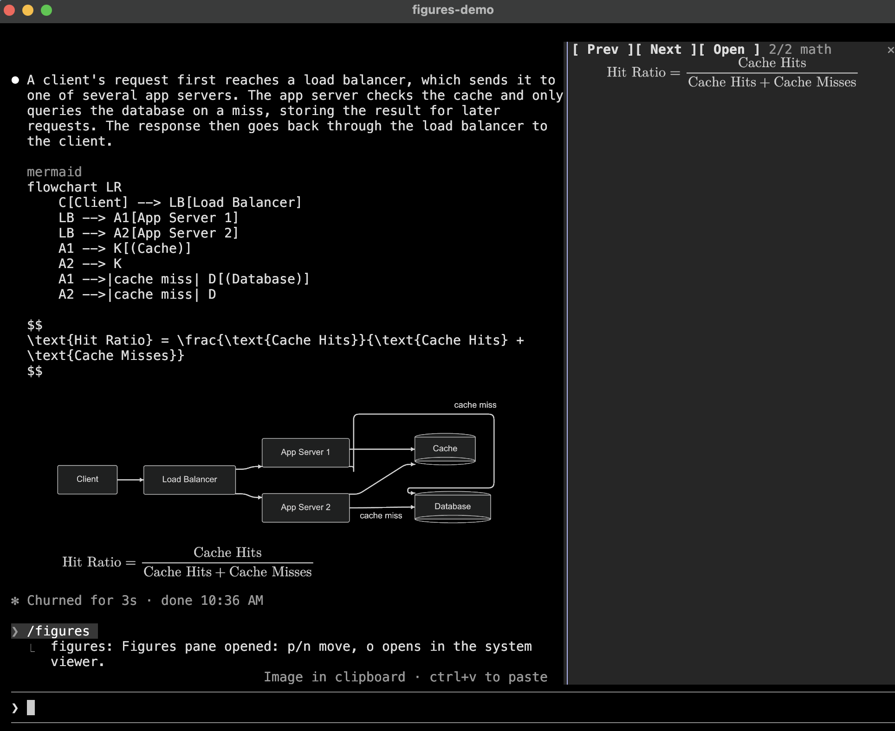

# figures

A Claude Code mod that draws diagrams, LaTeX math, and tool-result images inline in the terminal
transcript, using the kitty graphics protocol.



## What it draws

- **Diagrams.** A code block tagged `mermaid`, `dot` (or `graphviz`), `d2`, or `svg` in Claude's
  reply is rendered and drawn under the reply. The code stays visible above the picture.
- **Math.** LaTeX display math, `$$ … $$`, `\[ … \]`, or a `math`, `latex`, or `tex` code block, is
  typeset with [MathJax](https://www.mathjax.org). Inline `$…$` stays text, since a picture cannot
  sit inside a line, and a `latex` block holding a whole document (`\documentclass`) stays code.
- **Tool-result images.** `Read` on a PNG, JPEG, GIF, WebP, or SVG file, or a screenshot an MCP
  tool returns, is drawn under the tool's row, where Claude Code otherwise shows only a size line;
  an SVG read only in part is left alone. In a collapsed tool group they are thumbnails; ctrl+o
  unfolds the group and draws them full size. A PNG, JPEG, GIF, WebP, or SVG Claude sends to another
  device with `SendUserFile` is drawn under its attachment line too, so it is on screen when you
  come back to the terminal. It is read from disk when the row is first drawn; overwriting the file
  later leaves that picture as it was.

A picture the size caps would shrink below 60% of its natural size grows up to the terminal's
height, and one still smaller says so under it, such as `shown at 43% · /figures to enlarge`.

`/figures` opens a pane with the session's pictures, starting on the newest one drawn too small to
read, or else the newest. `p` and `n` step through them, `o` opens the current one with `open`
(macOS) or `xdg-open`, and Escape or your next prompt closes the pane.



The plugin also ships a `diagrams` skill, which tells Claude which languages are drawn and how to
write them so they render.

Each rendered PNG is cached under `$TMPDIR/claude-figures/`, named by a hash of the source and the
theme, so a resumed session draws its pictures again without re-rendering. Files older than seven
days are removed when a session starts.

## Requirements

Claude Code 2.1.287 or later, with mods (function-hook plugins) enabled, in a terminal it treats as
kitty-graphics capable; see [Terminal support](#terminal-support). Each kind of picture also needs
programs on `PATH`:

| Picture                    | Needs                                                                                                                                                                        |
| -------------------------- | ---------------------------------------------------------------------------------------------------------------------------------------------------------------------------- |
| `mermaid`                  | [`mmdr`](https://github.com/1jehuang/mermaid-rs-renderer) or [`mmdc`](https://github.com/mermaid-js/mermaid-cli); [`resvg`](https://github.com/linebender/resvg) recommended |
| `dot`, `graphviz`          | Graphviz's `dot` and `resvg`                                                                                                                                                 |
| `d2`                       | [`d2`](https://d2lang.com) and `resvg`                                                                                                                                       |
| `svg`, math                | `resvg`                                                                                                                                                                      |
| Tool images other than PNG | `magick` (ImageMagick) or `sips` (built into macOS)                                                                                                                          |

- mmdr is tried first, since it renders in milliseconds where mmdc starts a headless browser. mmdc
  runs mermaid.js itself, so a block mmdr fails on is handed to it when it is installed.
- Without resvg, mmdr writes its PNG at 1x, which looks soft on a high-density display; with it,
  the diagram is rendered to SVG and rasterized at the `scale` option.
- MathJax 4 and every glyph range of its New Computer Modern font are bundled, and run inside
  Claude Code, so math needs no Node.js.
- A block none of whose renderers is installed is left as code without an error, since it still
  reads as text. An error is shown only when an installed renderer fails.

## Install

```sh
claude plugin marketplace add natsukium/claude-code-figures-plugin
claude plugin install figures@figures
```

Install mmdr with `cargo install mermaid-rs-renderer`.

## Options

Set these with `/config` or `claude plugin configure figures`.

| Option                | Default       | Meaning                                                                                                                                                                           |
| --------------------- | ------------- | --------------------------------------------------------------------------------------------------------------------------------------------------------------------------------- |
| `theme`               | `auto`        | `auto` follows Claude Code's theme; or `dark`, `default`, `forest`, `neutral`, `modern` (mmdr only; mmdc draws it as `default`). Math is drawn light on `dark` and dark otherwise |
| `background`          | `transparent` | Diagram background; `transparent` lets the terminal's background show through                                                                                                     |
| `scale`               | `2`           | Pixel density of the picture; above 1 needs resvg                                                                                                                                 |
| `cell_width_px`       | `8`           | Assumed width of one terminal cell, in the pixels diagrams are laid out in                                                                                                        |
| `cell_aspect`         | `2.1`         | Assumed height-to-width ratio of one terminal cell                                                                                                                                |
| `max_columns`         | `120`         | Widest a picture may be, in cells; it is also kept inside the terminal                                                                                                            |
| `max_rows`            | `30`          | Tallest a picture may be before it is grown for legibility, in cells                                                                                                              |
| `renderers`           | (empty)       | Renderer ids in preference order, comma-separated; see below                                                                                                                      |
| `tool_images`         | `true`        | Draw images found in tool results                                                                                                                                                 |
| `tool_image_max_rows` | `12`          | Tallest a tool-result thumbnail may be, in cells                                                                                                                                  |

`renderers` picks and orders the programs that draw each language. The ids are `mmdr` and `mmdc`
(mermaid), `dot`, `d2`, `svg`, and `mathjax`. A language with any of its renderers listed uses only
those, in the listed order; the others keep the default. So `mmdc` draws mermaid with mmdc alone,
and `mmdc,mmdr` tries mmdc first. An id no renderer has is reported when a session starts.

## Terminal support

Claude Code enables pictures only when the terminal's XTVERSION reply names kitty (0.28.0 or later)
or Ghostty. A terminal that answers the kitty graphics query correctly under any other name still
gets the `alt` text, such as `[mermaid diagram 1]`. Setting `TERM` or `TERM_PROGRAM` has no effect.

To use the plugin on such a terminal, set the override Claude Code reads:

```sh
CLAUDE_CODE_FORCE_TERMINAL_IMAGES=1 claude
```

This also skips Claude Code's tmux check. Inside tmux, the pictures additionally need
`set -g allow-passthrough on`.

To see what Claude Code decided, start it with `--debug` and look for the `Terminal capabilities:`
line in the debug log.

## Limitations

- The picture's size in cells is estimated from `cell_width_px` and `cell_aspect`, since mods are
  not told the terminal's cell size in pixels. Adjust them if pictures look stretched.
- Mods cannot read the terminal's background color, so `theme=auto` follows Claude Code's own
  theme (`/config`): a `light` variant draws light pictures, the others dark. When Claude Code's
  theme is itself `auto`, its resolved value is not exposed, so `COLORFGBG` decides where the
  terminal exports it, and dark otherwise.
- mmdr parses Mermaid on its own and does not match mermaid.js in every case. For example, a chained
  edge with labels (`A --> B -->|ok| C`) is misparsed; write one edge per line. Such a block renders
  without an error, so it is not handed to mmdc; set `renderers` to `mmdc` to avoid mmdr.
- Text in a script the math font lacks, such as `\text{日本語}`, is drawn by resvg with a system
  font.
- The `/figures` pane shares the screen with the prompt, so in a short terminal it has only a few
  rows; `o` opens the picture at full size outside the terminal.

## Development

`tsconfig.json` extends the engine's typings in `.claude-plugin/types/`, which Vite and Vitest read
as well as tsc. Claude Code writes them only when it loads the plugin from this folder, and no
command writes them alone, so `pnpm types` starts `claude -p --plugin-dir .` with a dummy API key
and ignores the failed request once the typings exist. `build`, `test`, and `typecheck` run it
first. Claude Code is a dev dependency, so the scripts and `pnpm exec claude` use the version
pinned in `pnpm-lock.yaml`, whatever `claude` is on `PATH`.

```sh
pnpm install
pnpm build              # regenerate hooks/vendor/
pnpm test               # unit tests (Vitest, tests/unit/*.spec.ts)
pnpm typecheck
pnpm exec claude plugin validate .
pnpm exec claude plugin test .    # hooks through the engine (tests/engine/*.test.ts)
```

Claude Code loads `hooks/` as TypeScript source, so only third-party code is built. `pnpm build`
bundles MathJax and `@noble/hashes` with Vite into `hooks/vendor/`, which is committed so the
repository stays installable as is. A hooks module imports no file over 1 MiB and cannot import
modules at run time, so the build splits the bundle into chunks and writes each of the font's
glyph ranges as JSON, which the plugin reads the first time a formula uses it.

The engine refuses a module that passes `$` across an import, so `hooks/register.tsx` wraps what
the plugin needs from `$` in an `Io` object (`hooks/io.ts`), and every other module takes that.

## License

Apache-2.0. `hooks/vendor/` is built from [MathJax](https://github.com/mathjax/MathJax-src) and its
[New Computer Modern font](https://github.com/mathjax/MathJax-fonts), both Apache-2.0, and
[`@noble/hashes`](https://github.com/paulmillr/noble-hashes), MIT.
